# Compute Lab: Launching an EC2 instance

## Overview

This lab introduces the core functions of Amazon EC2, including launching, resizing, managing, and monitoring virtual instances. EC2 is a flexible cloud service that offers scalable compute capacity, enabling developers to deploy applications quickly and efficiently. Its user-friendly interface allows rapid provisioning and configuration, with full control over resources. EC2 supports dynamic scaling and pay-as-you-go pricing, making it cost-effective. It also equips developers with tools to build resilient applications that can withstand common failure scenarios.

## Topics covered

By the end of this lab, I will be able to:

- Launch a web server with termination protection enabled

- Monitor the EC2 instance

- Modify the security group that the web server is using to allow HTTP access

- Resize Amazon EC2 instance to scale

- Test termination protection

- Terminate the EC2 instance

## Following are the steps I took:

### Launching an EC2 Instance

- Named the instance “Web Server”

- Selected Amazon Linux 2023 AMI

- Chose instance type: t3.micro

- Enabled termination protection

- Skipped key pair setup (no SSH access required)

#### Configure Networking and Security

- Placed instance in the Lab VPC

- Created a custom security group

- Did not allow SSH access for added security

#### Add Storage and User Data

- Kept default 8 GiB EBS volume

- Added a User Data script to:

    - Install Apache web server

    - Start the Apache service

    - Create a basic HTML page with “Hello From Your Web Server!”

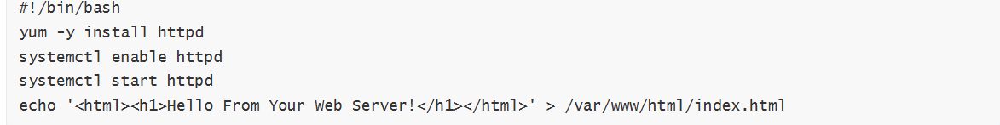

#### Instance launch

- After configuring EC2 instane settings, lanched the instance.

### Monitor the Instance

- Verified system and instance status checks

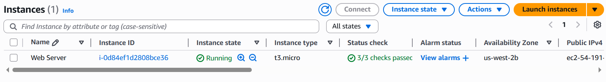

- Used CloudWatch to monitor performance

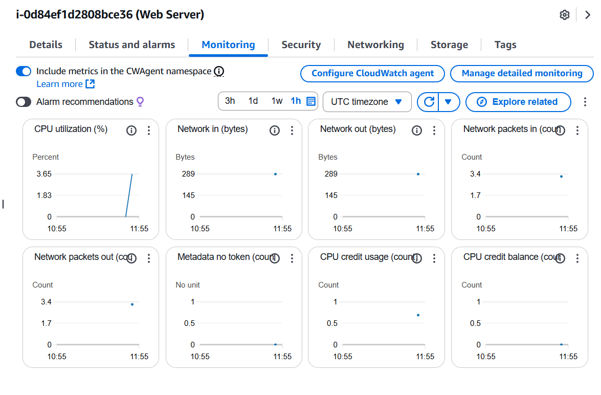

- Captured a console screenshot for troubleshooting simulation

### Access the Web Server

- Modified security group to allow HTTP traffic on port 80

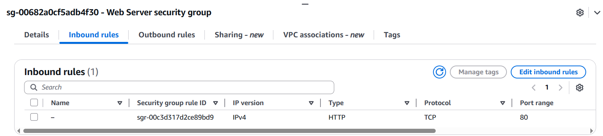

- Refreshed browser to confirm the web page was accessible

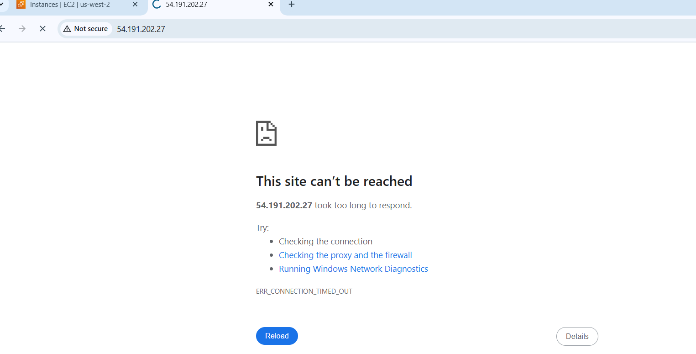 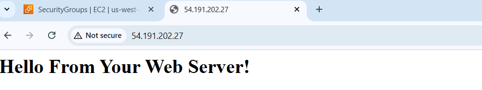

### Resize the Instance

- Stopped the instance

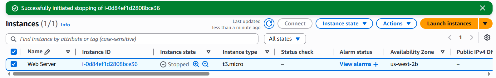

- Changed instance type to t3.small

- Increased EBS volume from 8 GiB to 10 GiB

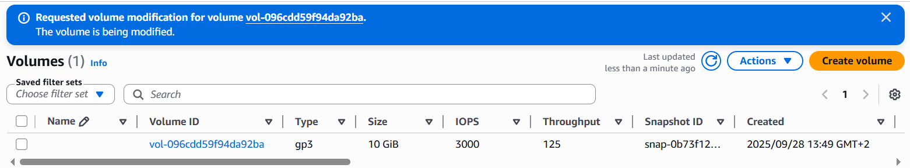

- Restarted the instance and verified changes

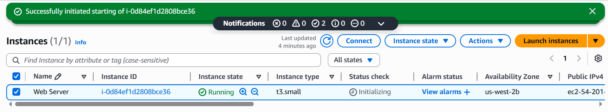

### Test Termination Protection

- Attempted to terminate the instance (blocked due to protection)

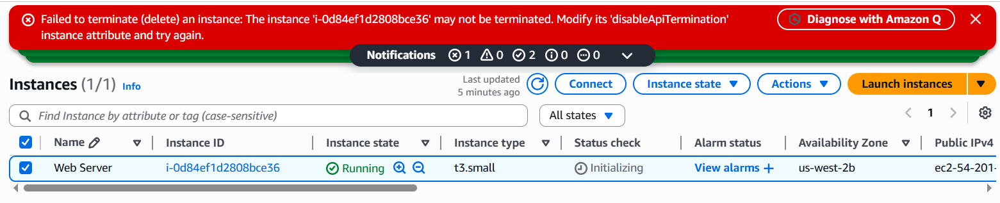

- Disabled termination protection

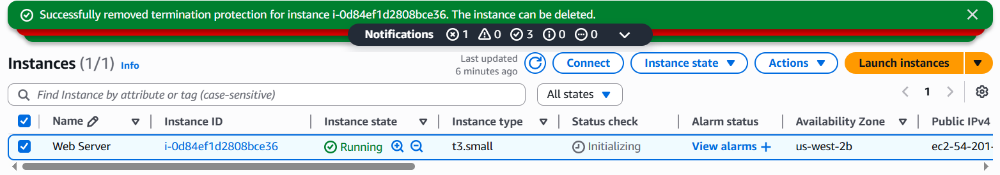

- Successfully terminated the instance

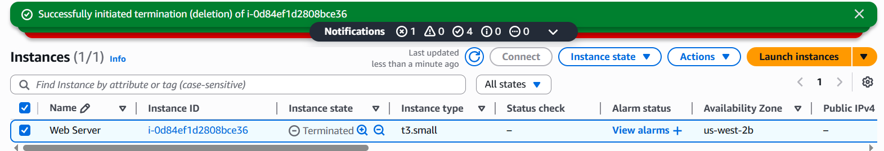

## Conclussion

This lab provided a hands-on introduction to launching, configuring, and managing an Amazon EC2 instance. By working through tasks such as setting up networking, automating server initialization, monitoring performance, and resizing resources, I gained practical insight into cloud infrastructure and compute services. The experience reinforced key AWS concepts like scalability, security, and cost-efficiency—laying.