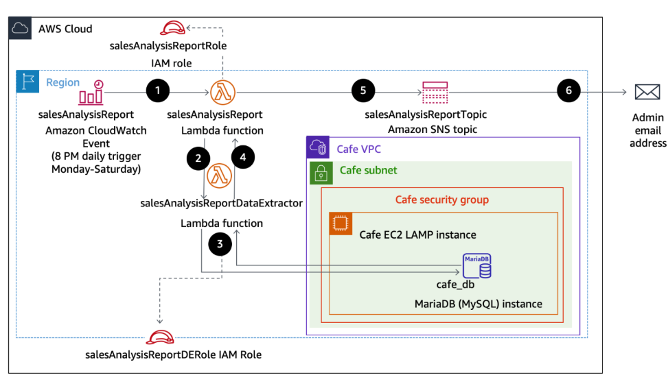

# Working with AWS Lambda

## Lab overview

In this lab, I implemented a serverless solution using AWS Lambda to automate daily sales reporting. The Lambda function retrieved data from a backend database hosted on a LAMP-based EC2 instance and emailed the results. Connection credentials were securely managed using AWS Systems Manager Parameter Store, ensuring safe and efficient access to the database.

The diagram below outlines the structure of the sales analysis reporting system and highlights the sequence of operations involved.

The diagram icludes the following streps:

1. An Amazon CloudWatch Events event calls the salesAnalysisReport Lambda function at 8 PM every day Monday through Saturday.

2. The salesAnalysisReport Lambda function invokes another Lambda function, salesAnalysisReportDataExtractor, to retrieve the report data.

3. The salesAnalysisReportDataExtractor function runs an analytical query against the café database (cafe_db).

4. The query result is returned to the salesAnalysisReport function.

5. The salesAnalysisReport function formats the report into a message and publishes it to the salesAnalysisReportTopic Amazon Simple Notification Service (Amazon SNS) topic.

6. The salesAnalysisReportTopic SNS topic sends the message by email to the administrator.

## Objectives

- Identify the IAM policy permissions required for a Lambda function to interact with other AWS services.

- Build a Lambda layer to manage external library dependencies.

- Develop Lambda functions that retrieve data from a database and deliver reports to users.

- Configure and validate a scheduled Lambda function that triggers another function.

- Utilize CloudWatch logs to diagnose and resolve issues with Lambda function execution.

## Tasks

### Task 1: Observing IAM Role Settings

- Reviewed IAM roles required for Lambda functions.

- salesAnalysisReportRole: Permissions include SNS, SSM (read-only), CloudWatch Logs, and invoking other Lambda functions.

- salesAnalysisReportDERole: Permissions include CloudWatch Logs and VPC access.

### Task 2: Creating a Lambda Layer & Data Extractor Function

1.	Lambda Layer: Created pymysqlLibrary layer containing PyMySQL client for database access.

2.	Data Extractor Function: Created salesAnalysisReportDataExtractor Lambda function using Python 3.9 with salesAnalysisReportDERole.
3.	Added the custom layer, uploaded function code, and configured handler.
4.	Configured VPC, subnet, and security group for database access.

### Task 3: Testing the Data Extractor

- Retrieved database connection parameters from Parameter Store.

- Initial test failed due to timeout (port 3306 not open in security group).

- Fixed issue by updating inbound rules for MySQL port.

- Function then successfully returned empty results (no orders).

- After placing test orders on the café website, function returned correct sales data in JSON format.

### Task 4: Configuring Notifications (SNS)

1.	Created SNS topic salesAnalysisReportTopic with display name SARTopic.

2.	Subscribed an email endpoint and confirmed the subscription.

### Task 5: Creating the Sales Analysis Report Function

1.	Function Creation: Used AWS CLI to create salesAnalysisReport Lambda function with Python 3.9 and salesAnalysisReportRole.

2.	Configuration: Added SNS topic ARN as environment variable.

3.	Testing: Invoked function successfully, which sent sales analysis report via email.

4.	Automation: Added EventBridge (CloudWatch Events) trigger with cron expression to schedule daily report delivery (Mon–Sat at 8 PM UTC).

## Key Learnings
- IAM roles and permissions are critical for secure Lambda operations.

- Lambda layers simplify code reuse across functions.

- Proper VPC and security group configuration is required for database connectivity.

- SNS enables reliable notification delivery via email subscriptions.

- EventBridge provides automation for scheduled report generation.

## End Result 
- A fully automated serverless pipeline that extracts sales data, formats it, and sends daily reports via email.